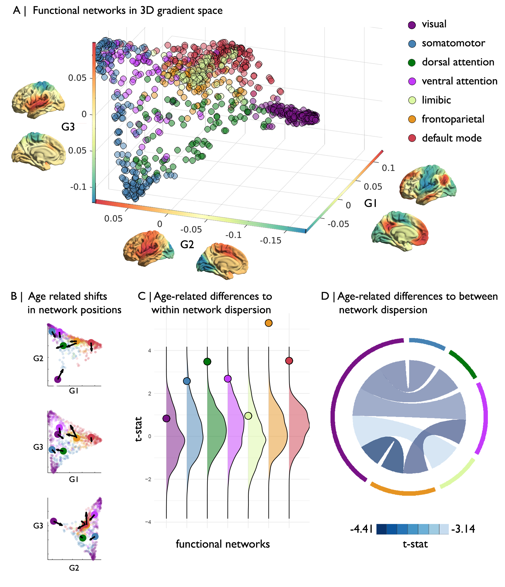

# Figure 1

Functional gradients across healthy adulthood. A) First three gradients projected into a 3-dimensional gradient space and coloured by its Yeo network classification. Average gradient topology of the holdout are depicted on each axis. B) Age-related shift in the centroid of each Yep network in gradient space. Arrows reflect the direction of the centroid shift and are scaled by effect size. C) Age-related difference in within network dispersion. Dots indicate the actual t-statistic of the dispersion. Distribution capture the spin-permuted null distribution t-values. D) Age-related difference in between network dispersion. Only pairs showing a significant age-related change are depicted.
