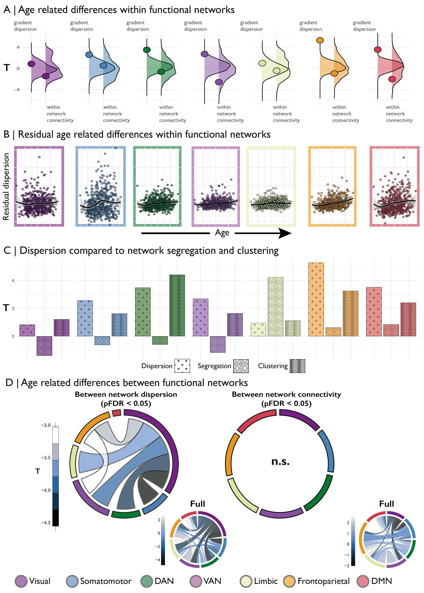

# Figure 2  

Panel A shows the age-related difference (t-statistic) in within network dispersion and within network connectivity for each of Yeo network. Underlying density plots show the null distributions of t-statistics derived from spin permutations. Panel B shows the residuals of the dispersion model (including controls for sex, motion and within network connectivity) against age residuals for the same model for each Yeo network. Panel C depicts t-statistics for age-related differences in Yeo network for within network dispersion, segregation (Chan 2014) and clustering (Rubinov 2010). Panel D shows the between network dispersion and between network connectivity. Network borders are scaled according to the size of the total effect from that community (e.g. the visual network is largest in the left panel as most significant between network dispersion involved the visual network. Insert panels on the right show the full between network pattern for all connections including non-significant ones.
