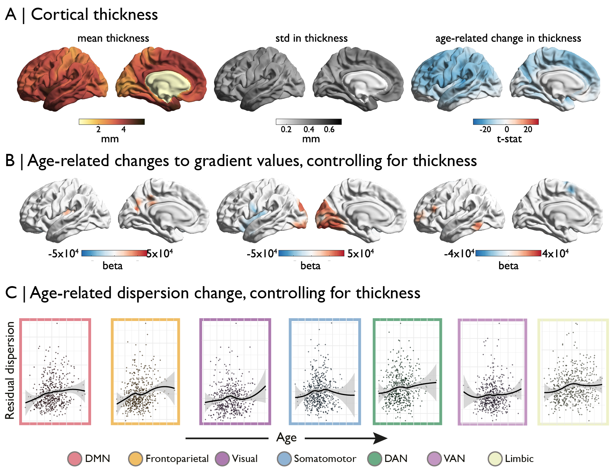

# Figure 3

Morphological changes in cortical thickness are widespread and uniformly negative (Panel A). Age-related changes to the gradients are not effected by this cortical atrophy (Panel B) nor are the multi-dimensional changes in gradient dispersion (Panel C).
