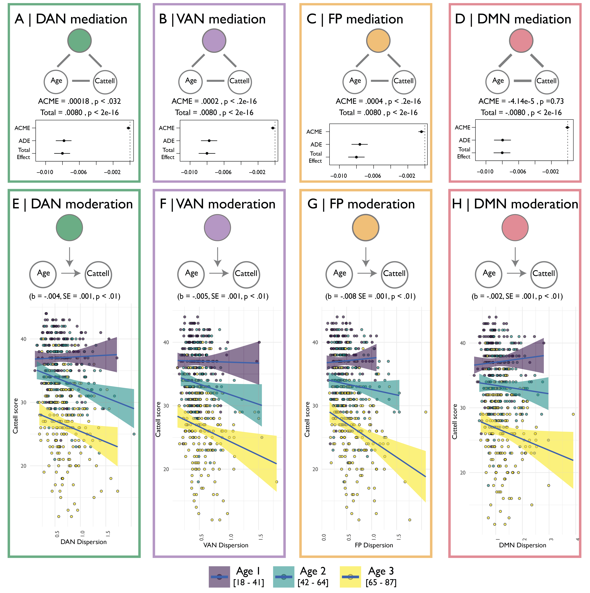

# Figure 4

Mediation of age-related cognitive decline. Panels A-D show the mediation effects of network showing significant age-related change in gradient dispersion on the age-related change in cognitive decline. For each network the path and average causal mediation effect (ACME) based on bootstrapping are shown. Dot-plots also provide the average direct effect (ADE) estimates and confidence intervals. Panels E-H show the moderating effects of the same networks' dispersion on age and Cattel score. Scatterplots show how this effect varied in three bins of the total age-range.  
